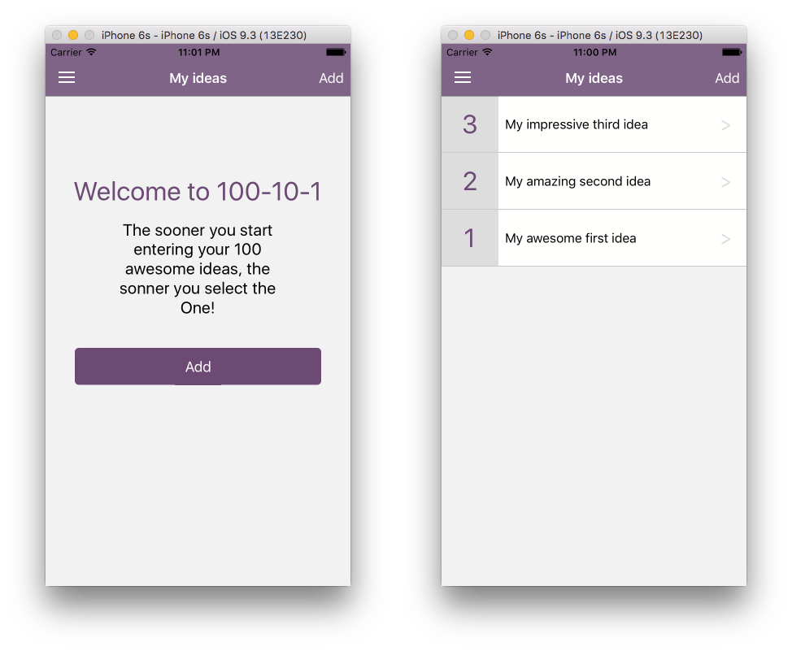
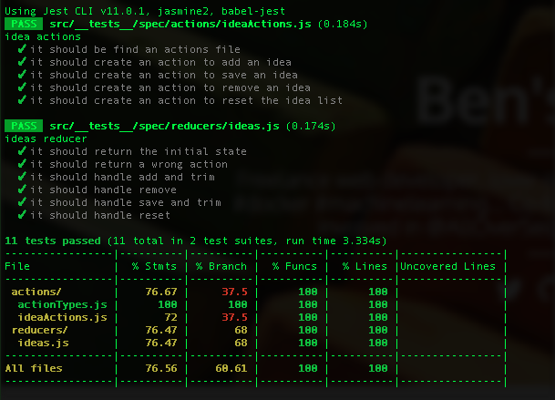

# React Native App with redux for the 100-10-1 method

[](https://travis-ci.org/benoitvallon/react-native-redux-app-100-10-1) [](https://david-dm.org/benoitvallon/react-native-redux-app-100-10-1) [](https://david-dm.org/benoitvallon/react-native-redux-app-100-10-1#info=devDependencies)

## Screenshot



## Libraries/tools

This project uses libraries and tools like:
- es6 syntax
- [react-native](https://facebook.github.io/react-native)
- [redux](http://redux.js.org) to organize the data flow management
- [redux-storage](https://github.com/michaelcontento/redux-storage) for the data persistence in the App
- [jest](https://facebook.github.io/jest) and [babel-jest](https://github.com/babel/babel-jest) for the tests

## What is the 100-10-1 method?

Basically, the 100-10-1 method is a method to sort out ideas. The concept is to start listing 100 "random" ideas, then narrow it down to 10 MVPs to finally select the One!

The term has been coined by Nick Bentley in his [excellent post describing his game design process](https://nickbentleygames.wordpress.com/2014/05/12/the-100-10-1-method-for-game-design/). If you want a detailed approach of the method I strongly encourage you to read his post.

Fogus has also written an [nice post about applying this method to open source projects selection](http://blog.fogus.me/2015/11/04/the-100101-method-my-approach-to-open-source/). If you are developer thinking of doing open source projects it is definitely worth reading.

# How to build/run the App

### Requirements for React Native on Mac

- OS X
- Xcode 6.3 or higher is recommended (Xcode only runs on Mac).
- Homebrew is the recommended way to install node, watchman, and flow.
- `brew install node`
- `brew install watchman`. We recommend installing watchman, otherwise you might hit a node file watching bug.
- `brew install flow`. If you want to use flow.

### Running the App

- `npm install` to install all the dependencies, React and React Native among others.
- Open `iosApp.xcodeproj` and hit run in Xcode.
- Hit `cmd+R` in your iOS simulator to reload the App and see your change!

# Run the tests

To run the tests, simply run:

```
npm test
```


